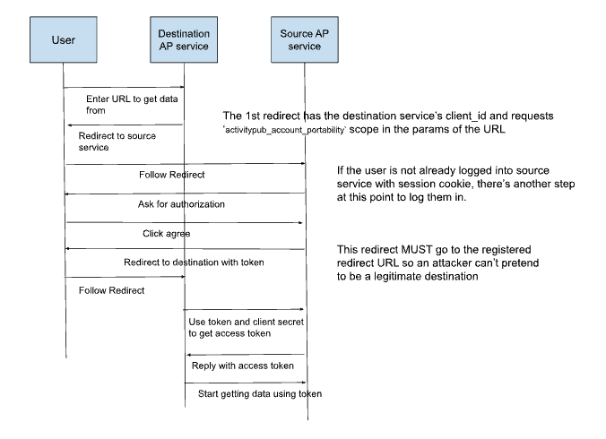

# OAuth Implementation Overview

This document describes the **complete OAuth 2.0 Authorization Code Flow** implemented in the ActivityPub/LOLA testbed. It explains the roles of Source and Destination services, outlines the step-by-step flow, and highlights security and compliance considerations.

## Context

The LOLA specification ([ActivityPub Data Portability](https://swicg.github.io/activitypub-data-portability/lola.html)) defines a protocol for **live account portability** between ActivityPub servers. Our implementation enables:

- Secure data transfers initiated by the **Destination service**.
- User-controlled authorization via the **Source service** (testbed).
- Standardized export of ActivityPub data in **JSON‑LD** format.
- Dual-mode authentication supporting both standard ActivityPub federation and enhanced LOLA portability features.

## Flow Overview

### **Key Actors**

- **User** – Account owner requesting portability.
- **Destination Service (Client)** – Initiates data import.
- **Source Service (Authorization Server)** – Hosts user data and issues tokens.

## OAuth Flow Diagram



## OAuth Flow Phases

### Phase 1: Registration & Application Setup

- **Purpose:** Establish trust between services by registering clients.
- **Process:**
    1. The service requesting data (Destination) registers with the service holding the data (Source).
    2. The Source issues credentials (client ID and client secret) and stores them securely.
    3. Redirect URIs and basic metadata are set for future authorization steps.

### Phase 2: Authorization Request & User Consent

- **Purpose:** Initiate the authorization process and request user approval.
- **Process:**
    1. The Destination service directs the user to the Source with a secure request containing client details and requested permissions.
    2. The user is prompted to log in if not already authenticated.
    3. A consent screen allows the user to approve or deny access to their data.

### Phase 3: Authorization Code & Callback

- **Purpose:** Deliver a temporary code confirming user consent.
- **Process:**
    1. Upon approval, the Source generates an authorization code.
    2. The user is redirected back to the Destination with this code and a state value to confirm request integrity.
    3. The Destination prepares to exchange this code for an access token.

### Phase 4: Token Exchange

- **Purpose:** Convert the authorization code into an access token.
- **Process:**
    1. The Destination securely sends the authorization code and its credentials to the Source.
    2. The Source validates the request and returns an access token.
    3. This token will be used for accessing protected resources.

### Phase 5: Protected Resource Access

- **Purpose:** Access user data from the Source service using the access token.
- **Process:**
    1. The Destination includes the token in its requests to retrieve data (e.g., profile, posts, followers).
    2. The Source validates the token and ensures the request is within the approved scope.
    3. Data is returned in JSON-LD format aligned with ActivityPub and LOLA standards.

## Data Transfer / Account Portability Features

### Account Recreation

- **Purpose:** Use the retrieved data to recreate the user’s account on the new service.
- **Process:**
    1. The Destination imports the user’s exported data.
    2. The user resumes activity seamlessly on the new platform.
    3. This phase concludes the portability process.

*Note: This phase is part of the broader Data Transfer and Account Portability workflow, utilizing the data obtained through the OAuth flow but extending beyond the core OAuth 2.0 specification.*

## OptionalOAuth2Authentication

Our implementation uses a custom OptionalOAuth2Authentication class that enables dual-mode operation on the same endpoints:

### Dual-Mode Operation

1. **Unauthenticated Mode:** Standard ActivityPub federation with public data
2. **Authenticated Mode:** Enhanced LOLA data with `activitypub_account_portability` scope

### Key Features

- **Graceful Degradation:** Invalid or missing tokens don't cause failures; requests continue as unauthenticated
- **Scope-Based Enhancement:** Only tokens with `activitypub_account_portability` scope unlock LOLA-specific data
- **Request Flags:** Adds `is_oauth_authenticated` and `has_portability_scope` flags to request objects
- **URL Parameter Authentication:** Supports `auth_token` URL parameter for testing convenience
- **Flexible Authentication:** Supports both Authorization header and URL parameter authentication

### **Benefits**

- Same endpoint serves both ActivityPub federation and LOLA portability
- No separate API versions needed
- Maintains backward compatibility with existing ActivityPub clients
- Provides enhanced data only when properly authenticated for portability

## Security Measures

### Current Implementation

- **Authorization Code Flow** – Chosen for confidential clients (most secure option).
- **Redirect URI Validation** — Prevents open redirect vulnerabilities via `ActivityPubOAuth2Validator`.
- **State Parameter** — Mitigates CSRF attacks with cryptographically secure state generation and validation.
- **Scope Validation** — Enforces `activitypub_account_portability` scope requirement for LOLA operations.
- **Session-based Client Secrets** — Raw secrets stored temporarily in session for token exchange.
- **OptionalOAuth2Authentication** — Graceful degradation prevents authentication failures from breaking federation.

### Future Enhancements

- **Hashed Client Secrets** — Store only hashed secrets in DB; show raw secret only once during registration.
- **HTTPS Enforcement** — Required in production environments.
- **Rate Limiting** — Implement rate limiting for token endpoints to prevent abuse.

### Common Error Cases Validation

- Invalid client_id or redirect_uri mismatch.
- Expired or invalid authorization code.
- Invalid or expired access token.
- Scope mismatch during token validation.

### **Data Access Validation**

- Verify returned data is JSON‑LD and LOLA-compliant.
- Ensure tokens allow only scoped access (e.g., activitypub_account_portability).
- Validate enhanced LOLA data is only provided to properly authenticated requests.
- Confirm public ActivityPub data remains accessible without authentication.

## **Implementation Notes**

- OptionalOAuth2Authentication — Core component enabling dual-mode operation for ActivityPub federation and LOLA portability.
- **One Application per User**: Simplifies testbed logic and mirrors real-world service isolation.
- **Session-based Secret Management** — Raw client secrets stored in session during OAuth flow for token exchange.
- **Comprehensive Testing** — Extensive test coverage ensures security and proper authentication behavior.
- **Credential Rotation**: Future enhancement — add secret regeneration endpoint for compromised clients.
- **Logging**: Record significant events (registration, authorization, token exchange) without exposing secrets.
- **Compliance**: Aligns with [RFC 6749](https://datatracker.ietf.org/doc/html/rfc6749) and LOLA portability guidelines.

## Real-Case Example

**Scenario:** A developer of “MyFediverse” registers their service and imports data:

1. Registers service at testbed → receives client_id and client_secret.
2. User at MyFediverse clicks “Import from Testbed.”
3. Redirects to testbed for login and consent.
4. Authorization code exchanged for token with activitypub_account_portability scope.
5. MyFediverse retrieves enhanced ActivityPub data (profile, posts, followers) including LOLA-specific collection URLs.


## OAuth Implementation Diagram with Methods and Files Involved

*This diagram demonstrates the complete OAuth flow implementation showing the specific templates, views, and methods involved in each phase. It serves as a technical reference for understanding how the OAuth flow maps to actual code components in the testbed.*

```
┌──────────────────┐          ┌──────────────────┐          ┌──────────────────┐
│                  │          │                  │          │                  │
│  User (Resource  │          │   Source (Auth   │          │   Destination    │
│      Owner)      │          │     Server)      │          │     (Client)     │
│                  │          │                  │          │                  │
└────────┬─────────┘          └────────┬─────────┘          └────────┬─────────┘
         │                             │                             │
         │                             │                             │
         │                             │                             │
         │                             │                             │
         │                     ┏━━━━━━━━━━━━━━━━━━━━━━━━━━━━━━━━━━━━━━━━━━━━━┓
         │                     ┃  PHASE 1: REGISTRATION & APPLICATION SETUP   ┃
         │                     ┗━━━━━━━━━━━━━━━━━━━━━━━━━━━━━━━━━━━━━━━━━━━━━┛
         │                             │                             │
         │                             │  (1) Register Application   │
         │                             │ ←---------------------------┘
         │                             │  [Method: index() - views.py]
         │                             │  [Form: OAuthApplicationForm - oauth_connection_form.py]
         │                             │
         │                             │  (2) Client ID/Secret Generated
         │                             │  [Method: get_user_application() - oauth_utils.py]
         │                             │  [Generates credentials with random_client_id() & random_client_secret()]
         │                             │ ---------------------------→│
         │                             │                             │
         │                             │                             │
         │                     ┏━━━━━━━━━━━━━━━━━━━━━━━━━━━━━━━━━━━━━━━━━━━━━┓
         │                     ┃  PHASE 2: AUTHORIZATION REQUEST & CONSENT    ┃
         │                     ┗━━━━━━━━━━━━━━━━━━━━━━━━━━━━━━━━━━━━━━━━━━━━━┛
         │                             │                             │
         │  (3) User initiates account transfer at Destination       │
         │ ←-----------------------------------------------------┐   │
         │                             │                         │   │
         │                             │                         │   │
         │                             │  (4) Authorization URL Construction
         │                             │  [Method: Similar to test_authorization_view() - views.py]
         │                             │  [Uses generate_secure_state() - oauth_utils.py]
         │                             │ ←----------------------┘    │
         │                             │                             │
         │                             │                             │
         │ (5) Redirected to Source with Auth Request                │
         │ -----------------------------→                             │
         │                             │  [Handled by Django OAuth Toolkit]
         │                             │  [Route: oauth2_provider:authorize]
         │                             │  [Validator: ActivityPubOAuth2Validator - oauth_validators.py]
         │                             │                             │
         │ (6) Login if needed         │                             │
         │ ←-----------------------------                             │
         │                             │  [Django Authentication]    │
         │                             │                             │
         │(7) Authorization Page Displayed                          │
         │ ←-----------------------------                             │
         │                             │  [Template: oauth2_provider/authorize.html]
         │                             │                             │
         │ (8) User approves           │                             │
         │ -----------------------------→                             │
         │                             │  [Form submission to oauth2_provider:authorize]
         │                             │                             │
         │                             │                             │
         │                     ┏━━━━━━━━━━━━━━━━━━━━━━━━━━━━━━━━━━━━━━━━━━━━━┓
         │                     ┃  PHASE 3: AUTHORIZATION CODE & CALLBACK      ┃
         │                     ┗━━━━━━━━━━━━━━━━━━━━━━━━━━━━━━━━━━━━━━━━━━━━━┛
         │                             │                             │
         │                             │  (9) Redirect with code     │
         │                             │  [Django OAuth Toolkit code generation]
         │                             │  [Demo view: oauth_callback() - views.py]
         │                             │  [Template: oauth_callback.html]
         │                             │  [Validation: validate_state_from_session() - oauth_utils.py]
         │                             │ ---------------------------→│
         │                             │                             │
         │                             │                             │
         │                     ┏━━━━━━━━━━━━━━━━━━━━━━━━━━━━━━━━━━━━━━━━━━━━━┓
         │                     ┃  PHASE 4: TOKEN EXCHANGE                     ┃
         │                     ┗━━━━━━━━━━━━━━━━━━━━━━━━━━━━━━━━━━━━━━━━━━━━━┛
         │                             │                             │
         │                             │  (10) Token Exchange Request│
         │                             │  [Method: Similar to test_token_exchange_view() - views.py]
         │                             │ ←---------------------------┘
         │                             │                             │
         │                             │  (11) Token Generation      │
         │                             │  [Django OAuth Toolkit token endpoint]
         │                             │  [Route: oauth/token/]      │
         │                             │  [Demo view: test_token_exchange_view() - views.py]
         │                             │  [Template: oauth_token_exchange.html]
         │                             │ ---------------------------→│
         │                             │                             │
         │                             │                             │
         │                     ┏━━━━━━━━━━━━━━━━━━━━━━━━━━━━━━━━━━━━━━━━━━━━━┓
         │                     ┃  PHASE 5: PROTECTED RESOURCE ACCESS          ┃
         │                     ┗━━━━━━━━━━━━━━━━━━━━━━━━━━━━━━━━━━━━━━━━━━━━━┛
         │                             │                             │
         │                             │  (12) API Request with Token│
         │                             │  [Client uses token in Authorization header]
         │                             │  [OptionalOAuth2Authentication - authentication.py]
         │                             │ ←---------------------------┘
         │                             │                             │
         │                             │  (13). Return ActivityPub Data
         │                             │  [API views with OAuth protection]
         │                             │  [e.g., actor_detail(), portability_outbox_detail() - views.py]
         │                             │  [JSON-LD builders - json_ld_builders.py]
         │                             │ ---------------------------→│
         │                             │                             │
         │                             │                             │
         │                     ┏━━━━━━━━━━━━━━━━━━━━━━━━━━━━━━━━━━━━━━━━━━━━━┓
         │                     ┃  DATA TRANSFER / ACCOUNT PORTABILITY         ┃
         │                     ┗━━━━━━━━━━━━━━━━━━━━━━━━━━━━━━━━━━━━━━━━━━━━━┛
         │                             │                             │
         │                    (14) Account recreated at Destination  │
         │ ←-----------------------------------------------------┐   │
         │                             │                         │   │
         │                             │                         │   │
```