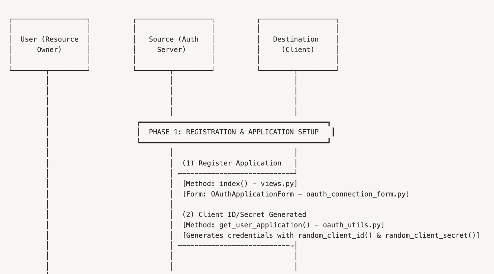

# **Phase 1: Registration & Application Setup**



## **Overview**

Phase 1 establishes the foundation of our OAuth 2.0 implementation for the testbed. It covers the **registration of applications** (representing ActivityPub services) and the creation of **immutable OAuth credentials**. This step is essential to establish trust between the authorization server (Source Service) and the client applications (Destination Services) participating in the LOLA data portability flow.

By completing this phase, each service obtains a unique **client ID** and **client secret** that identify it throughout the OAuth flow, enabling secure interactions during subsequent phases such as authorization, token exchange, and protected resource access.

## **Objectives of Phase 1**

- Enable new services to register with the Source Service and establish a trusted OAuth relationship.
- Generate **immutable credentials** (client ID and client secret) that remain consistent for the lifetime of the application.
- Provide a user interface and workflow for managing OAuth application settings.
- Enforce **security best practices** by ensuring credentials are securely generated, stored, and not user-editable.

## **Context in the LOLA Flow**

Within the **LOLA** portability process:

- The **Destination Service** (client) registers with the **Source Service** (authorization server).
- The Source Service generates the client ID and secret, which are immutable.
- The Destination Service securely stores these credentials and uses them in subsequent OAuth phases.

This **one user → one service → one application** model simplifies the flow while maintaining security and realism for testing ActivityPub implementations.

## **Core Components**

### **1. OAuth Application Form**

The OAuthApplicationForm (**`forms/oauth_connection_form.py`**) provides the interface for registering and configuring an OAuth application.

**Key Features:**

- **Model Binding:** Extends ModelForm from Django and is tied to the Application model from Django OAuth Toolkit.
- **Fields:** Collects essential client details (name, redirect_uris) and displays generated credentials (client_id, client_secret) as read-only.
- **Default Values:**
    - client_type = confidential — ensures credentials are securely handled.
    - authorization_grant_type = authorization-code — uses the most secure OAuth flow.
- **Validation:** Ensures redirect_uris are properly formatted and use valid protocols (http:// or https://).

**Why this matters:**

Proper validation and default configuration prevent common security pitfalls such as open redirect vulnerabilities or weak client handling.

### **2. Credential Generation & Storage**

Credential handling is implemented via the get_user_application() method (oauth_utils.py):

- **Immutable Credential Creation:** If the user has no existing application, new credentials are generated using secure random functions.
- **Session-Based Raw Secret Storage:**
    - The client secret is hashed when stored in the database for security.
    - The raw secret is temporarily stored in the user’s session and attached as a runtime-only attribute to the application object.
    - This allows it to be used for token exchange later without exposing it beyond its intended lifespan.

### **3. Index View**

The index() view serves as the **entry point** for Phase 1, integrating the form and utility logic:

- Displays the registration form to authenticated users.
- Pre-populates the form with existing application data (if available).
- Handles form submissions for updating application details like redirect URIs.
- Enforces immutability of client ID and client secret through both frontend (read-only fields) and backend (overridden save() method) safeguards.

## **Security Considerations**

- **Immutable Credentials:** Client ID and client secret cannot be edited after creation.
- **Session Storage:** Raw secrets are stored only in secure server-side sessions and never persisted in plaintext.
- **Redirect URI Validation:** Ensures callback URLs are safe and properly formatted; additional validation (e.g., allowlists, HTTPS-only) is recommended for production.
- **Audit Logging:** Key events (credential creation, retrieval, anomalies) are logged for traceability.

## **User Experience Flow**

1. **Initial Registration (New Application):**
    - User accesses the registration form.
    - New credentials are generated and displayed once.
    - Redirect URIs and service name can be configured.
2. **Subsequent Visits (Existing Application):**
    - Form is pre-filled with existing application data.
    - Credentials remain immutable; only redirect URIs or service name can be updated.
    - Raw client secret may be retrieved from session if needed for token exchange.
3. **Update Flow:**
    - User can update non-sensitive fields (e.g., redirect URIs).
    - Client secret regeneration is not part of this phase but may be considered for future enhancements.

## **Implementation Details**

### **Form Snippet**

```python
class OAuthApplicationForm(forms.ModelForm):
    class Meta:
        model = get_application_model()
        fields = ['name', 'client_id', 'client_secret', 'redirect_uris']
        labels = {
            'name': 'Service Name',
            'redirect_uris': 'Redirect URL'
        }
        widgets = {
            'client_id': forms.TextInput(attrs={'readonly': 'readonly'}),
            'client_secret': forms.TextInput(attrs={'readonly': 'readonly'}),
        }
```

### **Credential Handling Logic**

```python
def get_user_application(user, request=None):
    applications = Application.objects.filter(user=user)
    if applications.exists():
        application = applications.first()
        if request and CLIENT_SECRET_SESSION_KEY in request.session:
            application.raw_client_secret = request.session[CLIENT_SECRET_SESSION_KEY]
        return application

    # Generate new credentials
    client_id = random_client_id()
    client_secret = random_client_secret()

    if request:
        request.session[CLIENT_SECRET_SESSION_KEY] = client_secret

    application = Application.objects.create(
        user=user,
        name=f"{user.username}'s ActivityPub Service",
        client_id=client_id,
        client_secret=client_secret,
        redirect_uris='',
        client_type='confidential',
        authorization_grant_type='authorization-code'
    )
    application.raw_client_secret = client_secret
    return application
```

## **Future Enhancements**

- **Credential Rotation:** Implement a secure flow for regenerating client secrets when necessary.
- **Advanced URI Validation:** Enforce HTTPS and allowlist domains in production environments.
- **Scope Management:** Extend registration to include configurable scopes for fine-grained access control.
- **Enhanced Auditing:** Expand logging for compliance with security frameworks (SOC 2, ISO 27001).

## **Significance of Phase 1**

This phase creates the **secure foundation** for the entire OAuth implementation in our testbed. By enforcing credential immutability, secure secret handling, and clear user workflows, we establish trust and ensure a robust basis for subsequent phases:

- **Phase 2 – Authorization Request & User Consent**
- **Phase 3 – Authorization Code & Callback Handling**
- **Phase 4 – Token Exchange**