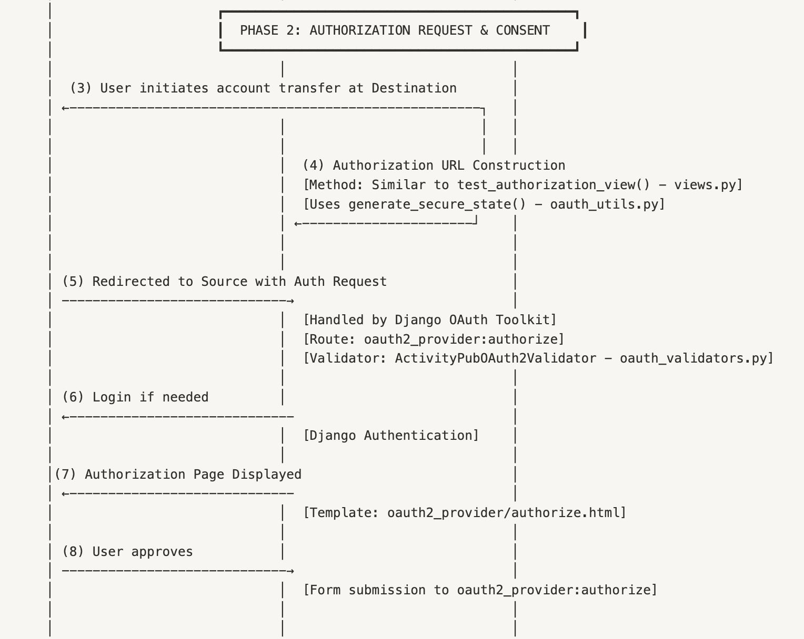

# **Phase 2: Authorization Request & User Consent**



## **Overview**

Phase 2 is the stage where the user explicitly authorizes the **Destination Service** to access their data from the **Source Service**. This phase introduces **user consent**, a core principle of OAuth 2.0 and the foundation of data portability in the LOLA implementation.

In this phase, the Destination Service constructs an **authorization request** and redirects the user to the Source Service’s authorization endpoint. The Source Service handles user authentication (if necessary) and presents a **consent screen** detailing the data to be shared. Upon user approval, the process transitions into **Phase 3: Authorization Code & Callback Handling**.

## **Objectives of Phase 2**

- Provide a secure mechanism for **user consent** within the OAuth flow.
- Ensure the **Destination Service** properly constructs the authorization request, including all required parameters.
- Validate **redirect URIs**, **scopes**, and **client credentials** at the Source Service.
- Prevent **CSRF attacks** using a cryptographically secure state parameter.
- Clearly communicate the scope and purpose of data sharing in the consent screen.

## **Context in the LOLA Flow**

Within LOLA portability:

- The **Destination Service** initiates the transfer/import process.
- The **Source Service** authenticates the user and requests explicit approval.
- The user’s consent authorizes the transfer of **entire account data**, not just isolated API resources.

This explicit consent step differentiates LOLA from many typical OAuth implementations, which often request narrower scopes (e.g., profile or email access).

## **Core Components**

### **1. Authorization URL Construction**

The **Destination Service** initiates the flow by building an authorization URL that includes the following parameters:

- **client_id** – Identifies the registered client application.
- **response_type** – Set to code for the Authorization Code flow.
- **redirect_uri** – The callback URL where the user will be redirected after granting or denying consent.
- **scope** – For LOLA, always activitypub_account_portability.
- **state** – A random value to prevent CSRF attacks.

Example URL:

```python
https://source-service.com/oauth/authorize?
client_id=abc123&
response_type=code&
scope=activitypub_account_portability&
redirect_uri=https://destination.com/callback&
state=secureRandomState
```

This URL is constructed dynamically in the **Destination Service’s** view, often using the current request’s scheme and host for the callback URI.

### **2. State Parameter Security**

The state parameter is critical for **CSRF protection**:

- **Generation** – Created using secrets.token_bytes() for cryptographic strength.
- **Encoding** – Encoded with URL-safe base64 and stripped of padding.
- **Storage** – Saved in the server-side session for later comparison.
- **Validation** – Checked upon callback; mismatches or missing values invalidate the request.

This pattern prevents:

- Cross-site request forgery attacks.
- Session fixation attempts.
- Authorization code injection.

**Relevant Functions:**

- generate_secure_state()
- store_state_in_session()
- validate_state_from_session()

### **3. Consent Screen**

The consent screen (authorize.html) is presented by the **Source Service** and includes:

- **Requesting Application Name** – Clearly identifies who is requesting access.
- **Purpose Explanation** – Describes why data transfer is requested (LOLA portability).
- **Explicit Permissions** – Lists specific data being transferred (e.g., posts, follows, likes).
- **Security Note** – Clarifies that authorization applies only to the registered destination service.
- **Action Buttons** – Clear “Authorize” and “Cancel” options.

**Security Measures:**

- CSRF protection via .
- Hidden fields for necessary OAuth parameters.
- Clear visual hierarchy and plain language for user comprehension.

### **4. Validation Logic**

Custom validation is implemented in ActivityPubOAuth2Validator:

- **Scope Validation:**
    - Ensures the activitypub_account_portability scope is present.
    - Logs warnings for invalid or missing scopes.
    - Enforces adherence to LOLA-specific security constraints.
- **Redirect URI Validation:**
    - Delegates to Django OAuth Toolkit for standard matching.
    - Logs invalid URIs and allows for future enhancements (e.g., HTTPS enforcement).

This ensures that only valid, registered redirect URIs and scopes can proceed through the authorization process.

## **Interaction Flow**

### **1. Initiation**

- User clicks “Import from [Source Service]” on the Destination Service.
- Destination Service constructs the authorization URL with required parameters and a secure state.

### **2. Redirection**

- User’s browser is redirected to /oauth/authorize at the Source Service.

### **3. Authentication**

- If not already authenticated, the user logs into the Source Service.

### **4. Consent Presentation**

- Source Service displays the consent screen, showing requested data and permissions.

### **5. User Decision**

- If approved: Source Service issues an authorization code and redirects to the registered redirect_uri.
- If denied: Redirect occurs with error parameters indicating denial.

## **Security Considerations**

- **State Parameter** – Prevents CSRF and replay attacks.
- **Redirect URI Validation** – Defends against open redirect and code interception attacks.
- **Scope Enforcement** – Limits granted permissions strictly to account portability.
- **Explicit User Consent** – Ensures the user has control over data transfer.
- **Logging** – Records key events for auditability (invalid scopes, URIs, approvals).


## **Implementation Example**

### **Authorization URL Construction (Destination Service)**

```python
@login_required
def test_authorization_view(request):
    application = get_user_application(request.user)

    # Construct callback URL
    redirect_uri = f"{request.scheme}://{request.get_host()}/callback"

    # Register redirect URI if not already present
    if redirect_uri not in application.redirect_uris:
        application.redirect_uris = f"{application.redirect_uris} {redirect_uri}".strip()
        application.save()

    # Generate secure state and store in session
    state = generate_secure_state()
    store_state_in_session(request, state)

    # Build authorization URL
    params = {
        'client_id': application.client_id,
        'response_type': 'code',
        'scope': 'activitypub_account_portability',
        'redirect_uri': redirect_uri,
        'state': state
    }

    query_string = '&'.join([f"{key}={value}" for key, value in params.items()])
    auth_url = f"{reverse('oauth2_provider:authorize')}?{query_string}"

    return redirect(auth_url)
```

## **Significance of Phase 2**

This phase embodies the **core consent principle** of OAuth: the user explicitly approves the data transfer. By enforcing strict scope validation, secure redirect URI handling, and robust CSRF protection, Phase 2 ensures:

- User trust in the account portability process.
- Protection against common OAuth attack vectors.
- A seamless transition into **Phase 3: Authorization Code & Callback Handling**.
