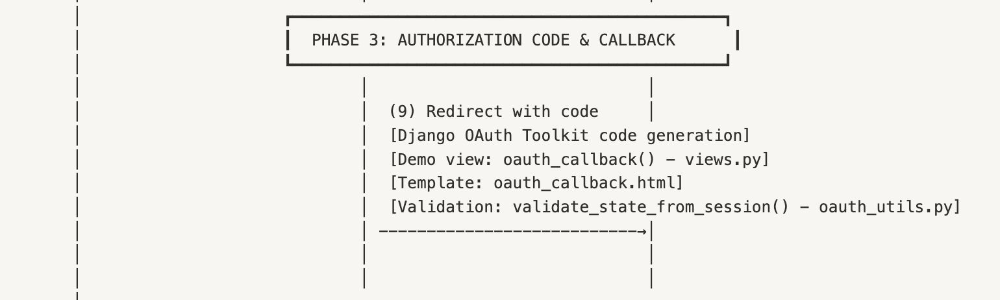

# **Phase 3: Authorization Code & Callback Handling**



## **Overview**

Phase 3 represents the secure bridge between **user consent** (Phase 2) and **token exchange** (Phase 4) in our OAuth 2.0 flow. At this stage, the **Source Service (Authorization Server)** issues a **short-lived authorization code** to the **Destination Service (Client)** after the user has granted consent. This code is delivered via a secure redirect to the client’s registered callback URI and serves as proof that the user has approved the data transfer.

In the context of LOLA portability, this phase confirms user intent to transfer their entire ActivityPub account data from the Source Service to the Destination Service, enabling the next step: requesting an access token.

## **Objectives of Phase 3**

- Deliver a **temporary, one-time-use authorization code** securely to the Destination Service.
- Maintain security integrity by validating the **state parameter** to prevent CSRF attacks.
- Ensure the code is properly **bound** to the specific client, scope, and redirect URI.
- Provide a clear **callback handling process** that prepares for token exchange.
- Handle **success and error scenarios** gracefully for the end-user and client application.

## **Context in the LOLA Flow**

This phase begins **after** the user has consented to the data transfer (Phase 2) and ends **before** the Destination Service exchanges the code for an access token (Phase 4). The key outcomes of this phase are:

- Confirmation of successful authorization by the Source Service.
- Delivery of a secure authorization code to the registered callback endpoint.
- Validation of the state parameter to confirm request integrity.
- Preparation for the token exchange process.

## **Core Components**

### **1. Authorization Code Generation**

- **Triggered by User Consent:** Once the user approves access on the Source Service’s consent screen, Django OAuth Toolkit generates an **authorization code**.
- **Security Properties:**
    - High-entropy random string (30–40 characters).
    - Valid for a short window (configured to 10 minutes in our testbed).
    - Bound to the requesting client_id, approved scope, and redirect_uri.
    - One-time use — automatically invalidated upon successful token exchange.

### **2. Secure Redirection**

After generating the authorization code:

- The Source Service **redirects the user’s browser** to the pre-registered redirect_uri on the Destination Service.
- The **authorization code** and the original **state parameter** are appended as query parameters, for example:

```
https://destination.com/callback?code=abc123&state=xyz789
```

This preserves the security context established earlier and signals the Destination Service to begin callback handling.

### **3. Callback Handling**

The **Destination Service** processes the callback via a dedicated view (oauth_callback):

- Extracts code, state, and any error parameters from the query string.
- Validates the state parameter against the stored session value to prevent CSRF.
- Distinguishes between success (valid code) and error scenarios (denied or invalid requests).
- Prepares the code for token exchange in Phase 4.

### **4. State Parameter Validation**

State validation ensures the callback originates from the legitimate request:

- Retrieves the stored state value from the user’s session.
- Immediately removes the state from session storage to prevent replay attacks.
- Compares the stored value and received value using **constant-time comparison** (secrets.compare_digest) to prevent timing attacks.

If validation fails, the request is rejected and logged as a potential security incident.

## **Implementation Details**

### **Authorization Code Handling (Callback View)**

```python
def oauth_callback(request):
    """
    Handle the callback from the OAuth server.
    Displays the authorization code or an error message.
    """
    code = request.GET.get('code')
    error = request.GET.get('error')
    error_description = request.GET.get('error_description')
    state = request.GET.get('state')

    context = {
        'code': code,
        'error': error,
        'error_description': error_description,
        'state': state
    }

    # Validate state parameter
    if not state:
        logger.warning("OAuth callback received with no state parameter")
        context['error'] = 'invalid_state'
        context['error_description'] = 'No state parameter provided'
    else:
        if not validate_state_from_session(request, state):
            logger.warning("OAuth callback received with invalid state parameter")
            context['error'] = 'invalid_state'
            context['error_description'] = 'Invalid state parameter'

    # Log success
    if code and not error and not context.get('error'):
        logger.info("Successfully received authorization code in callback")

    return render(request, 'oauth_callback.html', context)
```

### **State Validation Utility**

```python
def validate_state_from_session(request, state):
    stored_state = request.session.get(OAUTH_STATE_SESSION_KEY)

    if not stored_state:
        logger.warning("No OAuth state parameter found in session")
        return False

    # Prevent replay attacks
    request.session.pop(OAUTH_STATE_SESSION_KEY, None)

    # Constant-time comparison
    return secrets.compare_digest(stored_state, state)
```

## **Security Considerations**

- **Time-Limited Codes:** Authorization codes expire after 10 minutes.
- **One-Time Use:** Codes are invalidated immediately after token exchange.
- **Client Binding:** Codes are tied to the specific client_id and redirect_uri used during authorization.
- **State Parameter Validation:** Protects against CSRF and callback forgery.
- **HTTPS Enforcement:** All production environments should transmit authorization codes exclusively over HTTPS.

## **User Experience Flow**

1. **User Consent Granted:** Phase 2 completes, and the Source Service issues an authorization code.
2. **Redirection to Callback:** User is redirected to the Destination Service’s registered callback URI.
3. **Callback Processing:**
    - State is validated.
    - Authorization code is extracted and displayed/stored.
4. **Preparation for Token Exchange:** The code is now ready to be exchanged for an access token in Phase 4.

## **Future Enhancements**

- **PKCE Support:** Add code challenge/verification for public clients.
- **Enhanced Error Handling:** Provide user-friendly error pages with actionable next steps.
- **Replay Detection Metrics:** Add monitoring for repeated invalid state or expired code attempts.
- **Automated Transition to Token Exchange:** Optionally trigger Phase 4 immediately after successful callback.

## **Significance of Phase 3**

This phase ensures a **secure transition** between user consent and token issuance, preserving the integrity of the OAuth flow:

- Confirms the user’s explicit approval for data portability.
- Safeguards against CSRF and replay attacks through strict state validation.
- Establishes a short-lived credential (authorization code) for secure token exchange.

With this step complete, the system is prepared to move into **Phase 4: Token Exchange**, where the Destination Service obtains long-lived access credentials for data transfer.